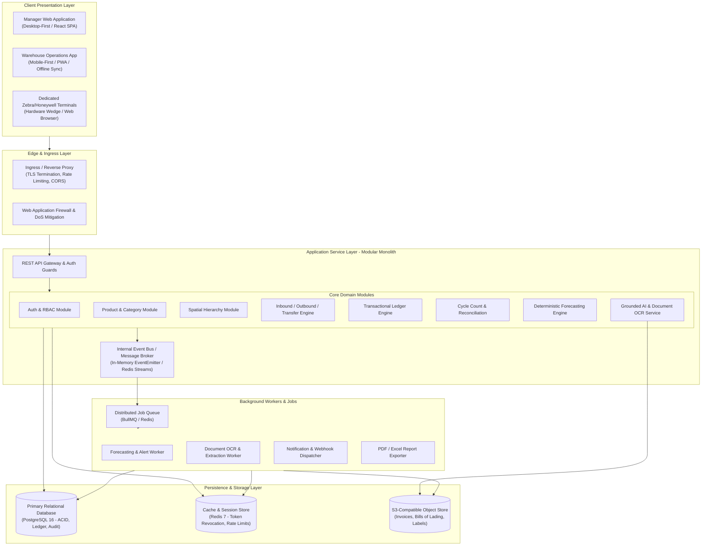
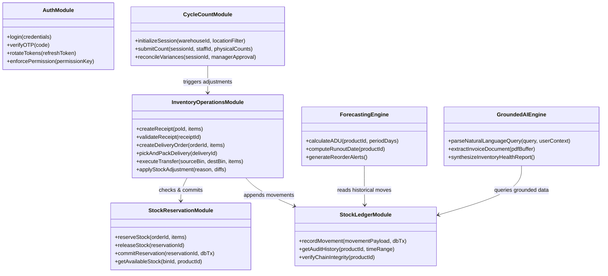
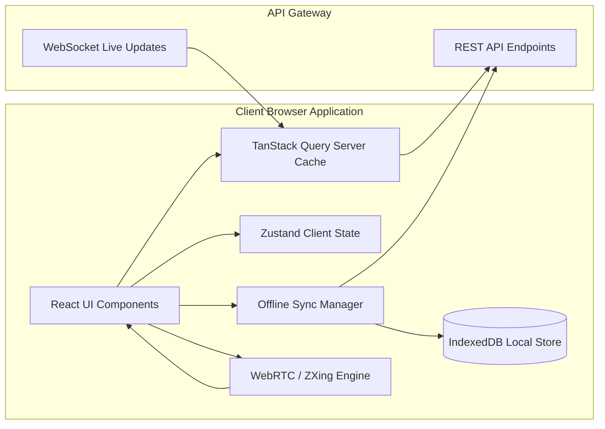
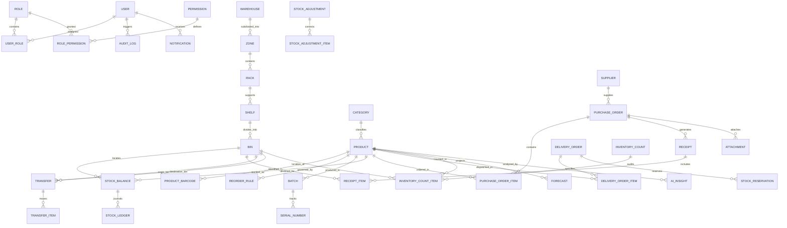
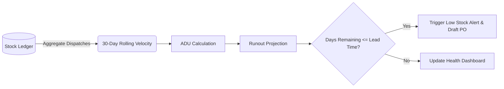
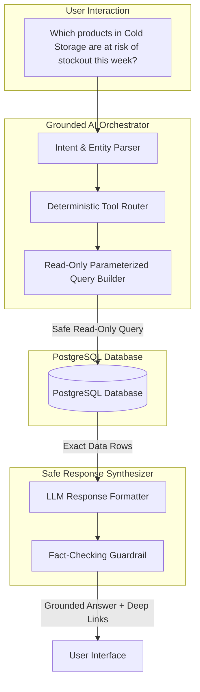
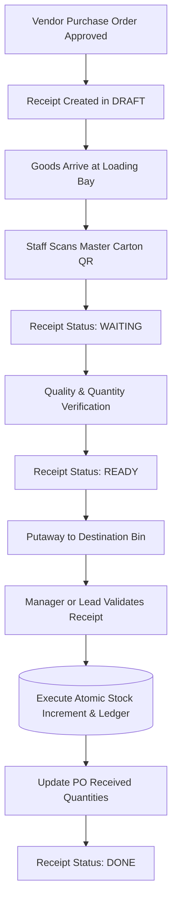
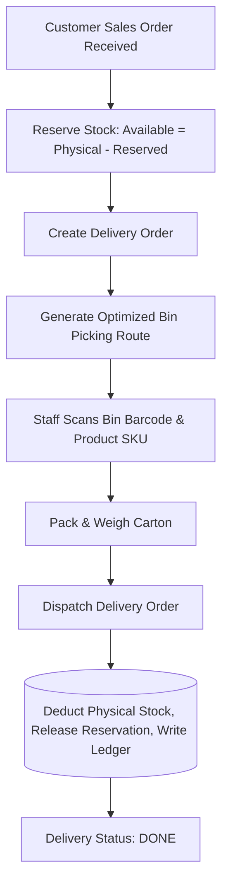
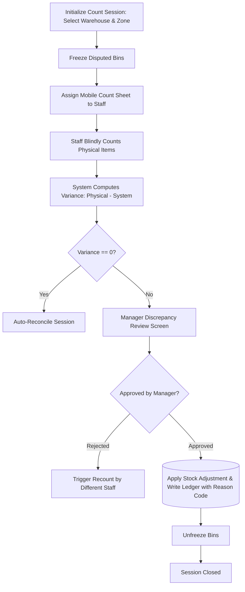
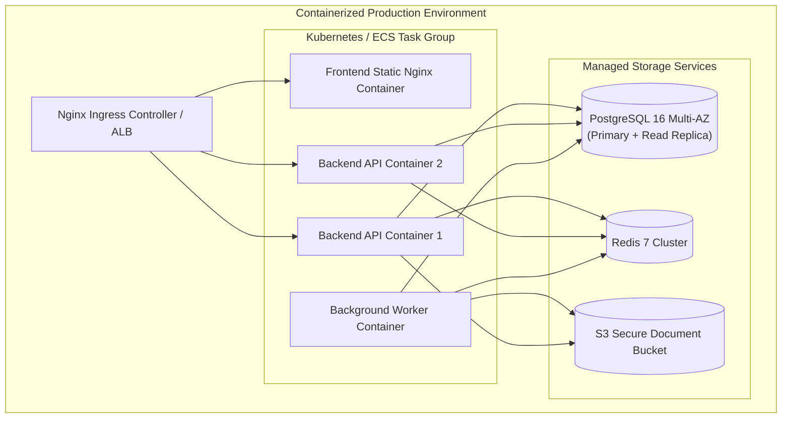

# StockSense — Technical Architecture & System Design Document

**Document Version:** 1.0.0  
**Status:** Approved Architectural Blueprint  
**System Classification:** Mission-Critical Intelligent Inventory Management System (IMS)  
**Primary Reference:** `StockSense.pdf` Problem Statement Specification  

---

## Executive Summary

StockSense is an enterprise-grade, real-time inventory platform engineered to transition traditional manual registers, disconnected spreadsheets, and fragmented warehouse tools into a single, high-precision transactional system. 

This document serves as the authoritative architectural blueprint for engineering the entire StockSense platform. It establishes the technical standards, domain models, consistency invariants, transaction boundaries, security paradigms, AI integration topologies, and deployment infrastructure required to build a resilient, scalable, and auditable system.

> **Operational Scope & Implementation Status:**  
> The core requirements defined by the authoritative problem statement (`StockSense.pdf`)—comprising **Identity & RBAC**, the **Central Transactional Inventory Engine**, **Multi-Warehouse Spatial Hierarchy**, **Inbound Receipts**, **Outbound Deliveries**, **Zero-Delta Internal Transfers**, **Physical Stock Adjustments**, the **Immutable Stock Ledger**, and the **Move History Timeline**—are **fully implemented and verified** with 52 automated tests passing against Neon PostgreSQL. Advanced intelligent extensions (grounded AI assistant, ML forecasting, and anomaly detection) are classified under the Phase 3–5 Future Roadmap.

---

## Table of Contents

1. [High-Level Architectural Overview](#1-high-level-architectural-overview)
2. [Component Architecture](#2-component-architecture)
3. [Frontend Architecture](#3-frontend-architecture)
4. [Backend Architecture](#4-backend-architecture)
5. [Database Architecture & Concurrency Strategy](#5-database-architecture--concurrency-strategy)
6. [Complete Domain Model & Entity-Relationship Diagram](#6-complete-domain-model--entity-relationship-diagram)
7. [Inventory Transaction Architecture & Consistency Rules](#7-inventory-transaction-architecture--consistency-rules)
8. [Advanced Stock Ledger Architecture](#8-advanced-stock-ledger-architecture)
9. [Authentication & Authorization (RBAC) Architecture](#9-authentication--authorization-rbac-architecture)
10. [API Architecture & Webhooks](#10-api-architecture--webhooks)
11. [Offline Synchronization Architecture (Warehouse Floor)](#11-offline-synchronization-architecture-warehouse-floor)
12. [Barcode & QR Code Scanning Engine](#12-barcode--qr-code-scanning-engine)
13. [Intelligent Forecasting & Analytics Architecture](#13-intelligent-forecasting--analytics-architecture)
14. [AI Inventory Assistant & Document Extraction Architecture](#14-ai-inventory-assistant--document-extraction-architecture)
15. [Notification & Real-Time Event Architecture](#15-notification--real-time-event-architecture)
16. [Background Jobs & Asynchronous Processing](#16-background-jobs--asynchronous-processing)
17. [Audit Logging & Compliance](#17-audit-logging--compliance)
18. [Document & File Storage Architecture](#18-document--file-storage-architecture)
19. [Caching & Performance Optimization](#19-caching--performance-optimization)
20. [Error Handling & Schema Validation](#20-error-handling--schema-validation)
21. [Security Architecture](#21-security-architecture)
22. [Core Operational Workflows (Mermaid)](#22-core-operational-workflows-mermaid)
23. [Project Directory & Module Structure](#23-project-directory--module-structure)
24. [Recommended Technology Stack & Justification](#24-recommended-technology-stack--justification)
25. [Testing Strategy](#25-testing-strategy)
26. [Deployment Architecture](#26-deployment-architecture)
27. [Phased Implementation Roadmap](#27-phased-implementation-roadmap)
28. [Architectural Decision Records (ADRs) & Risk Matrix](#28-architectural-decision-records-adrs--risk-matrix)

---

## 1. High-Level Architectural Overview

StockSense follows a **Modular Monolith** pattern with strict domain boundaries, event-driven decoupling for side effects, and asynchronous worker execution for heavy analytical and AI computations.

### Guiding Architectural Tenets
1. **Double-Entry Stock Invariant:** Inventory is never created or destroyed without a counter-balancing transaction source/destination; every stock change must correspond to an immutable ledger journal entry.
2. **Deterministic Domain Core:** Inventory arithmetic, reservation boundaries, and safety stock calculations must be 100% deterministic and isolated from external services.
3. **Grounded AI Safeguards:** Generative models and AI assistants act as query-and-synthesis interfaces over structured, validated application data—they never invent or hallucinate stock balances.
4. **Offline Resilience:** Warehouse floor devices (scanners, mobile tablets) must support intermittent connectivity during physical receiving, picking, and cycle counting.
5. **Zero Concurrency Drift:** High-velocity picking and bulk intake rely on explicit pessimistic database row locking (`SELECT FOR UPDATE`) to guarantee zero stock race conditions.



---

## 2. Component Architecture

The application is decomposed into clean, cohesive modules with well-defined contracts:



---

## 3. Frontend Architecture

### 3.1 Dual-Form Presentation Strategy
The frontend is a single unified React TypeScript codebase delivering two distinct UX experiences based on device viewport and user role:

1. **Manager Portal (Desktop Viewports $\ge$ 1024px):**
   - High-density data grids with column reordering, multi-column sorting, and virtual scrolling (`@tanstack/react-table` + `@tanstack/react-virtual`).
   - Sticky filter toolbars with multi-select faceted filters (Warehouse, Category, Document Status, Date Range).
   - Drawer/flyout panels for drill-down into Stock Ledgers and Product Timelines without page reload.
   - Interactive charts for stock turnover, runout velocity curves, and spatial warehouse occupancy.

2. **Warehouse Floor PWA (Mobile Viewports $<$ 1024px & Rugged Terminals):**
   - Large, tactile action buttons (minimum 48x48px tap targets) for gloved one-handed operation.
   - Integrated hardware barcode scanner listener (`keydown` wedge events) alongside WebRTC camera scanning.
   - Offline-capable work queues for picking, receiving, and counting backed by browser `IndexedDB`.
   - Visual and audio cues (distinct chime for valid scan, buzz for mismatch error).

### 3.2 State Management & Network Layer
- **Server State:** Handled exclusively via `@tanstack/react-query` with aggressive cache invalidation keys mapped to domain entities (`['products', id]`, `['ledger', warehouseId]`).
- **Client/UI State:** Minimal, atomic state via `Zustand` managing active warehouse selection, modal open/close states, scanner camera hardware status, and offline queue status.
- **Offline Storage:** `idb` (IndexedDB promise wrapper) for caching product barcodes, storage bin locations, and pending offline transactions.



---

## 4. Backend Architecture

The backend utilizes a **Clean Architecture / Hexagonal Architecture** within a modular monolith:

```text
backend/src/
├── core/                        # Cross-cutting infrastructural concerns
│   ├── database/                # Connection pools, Prisma/Kysely client
│   ├── event-bus/               # In-process and distributed event dispatchers
│   ├── errors/                  # Domain errors & RFC-7807 error middleware
│   ├── security/                # Crypto utils, JWT parser, OTP generator
│   └── logger/                  # Structured JSON logger (Pino)
└── modules/                     # Encapsulated Business Domains
    ├── auth/                    # Tokens, passwords, OTP, user accounts
    ├── catalog/                 # Products, categories, UoM, reorder rules
    ├── warehouse/               # Warehouses, zones, racks, shelves, bins
    ├── operations/              # Receipts, deliveries, transfers, counts
    ├── stock/                   # Materialized balances, reservations
    ├── ledger/                  # Append-only ledger writer and query engine
    ├── forecasting/             # Deterministic ADU and runout calculation
    ├── ai/                      # Vector embeddings, LLM tools, invoice OCR
    └── notifications/           # Push notifications, emails, webhooks
```

### Architectural Layering per Module
1. **Transport / Controller Layer:** Validates HTTP payloads via `Zod`, strips untrusted parameters, and maps HTTP requests to Command/Query objects.
2. **Application / Service Layer:** Implements business transactions, coordinates multi-entity mutations within database transactions, and dispatches domain events.
3. **Domain Layer:** Pure business entities, invariants, calculation functions (e.g., ADU formulas, FEFO sorting logic).
4. **Data Access / Repository Layer:** Encapsulates SQL queries, raw transaction handling, and database row locking.

---

## 5. Database Architecture & Concurrency Strategy

### 5.1 Relational Engine & Schema Segregation
- **Database Engine:** PostgreSQL 16+.
- **Isolation Level:** `READ COMMITTED` by default, elevated to explicit pessimistic row-locking (`SELECT FOR UPDATE`) during all stock balance mutations.
- **Table Partitioning:** The `stock_ledger` and `audit_log` tables are partitioned by **Range (Month)** on `created_at` to maintain millisecond query speeds even as records scale past tens of millions of rows.

### 5.2 Concurrency & Race Condition Elimination
In high-velocity warehouses, multiple workers may simultaneously attempt to pick, receive, or adjust the same SKU in the same bin. Unprotected operations cause negative stock, lost updates, and phantom reads.

#### Stock Mutex Invariant: Deterministic Ordered Row-Locking
When modifying stock across multiple bins or items (e.g., internal transfers or bulk receipts), records in `stock_balances` must **always be locked in lexicographical order of `(product_id, bin_id)`** to prevent deadlocks:

```sql
-- Pattern for modifying balance with zero race conditions
BEGIN TRANSACTION ISOLATION LEVEL READ COMMITTED;

-- 1. Deterministic lock acquisition to prevent deadlocks
SELECT id, physical_qty, reserved_qty 
FROM stock_balances 
WHERE product_id = :productId AND bin_id = :binId 
FOR UPDATE;

-- 2. Validate business invariant in-memory within locked scope
-- IF (physical_qty - reserved_qty < :requestedQty) ROLLBACK & THROW InsufficientStockError;

-- 3. Execute atomic balance mutation
UPDATE stock_balances 
SET physical_qty = physical_qty - :requestedQty,
    updated_at = NOW() 
WHERE product_id = :productId AND bin_id = :binId;

-- 4. Append immutable ledger journal entry
INSERT INTO stock_ledger (
    product_id, bin_id, movement_type, quantity, 
    qty_before, qty_after, reference_doc, performed_by
) VALUES (
    :productId, :binId, 'DELIVERY', -:requestedQty, 
    :currentPhysical, :currentPhysical - :requestedQty, :docId, :userId
);

COMMIT;
```

---

## 6. Complete Domain Model & Entity-Relationship Diagram



### Complete Entity Specification

```text
Core User & Auth:
• USER: id, email, password_hash, first_name, last_name, is_active, otp_secret, otp_expires_at, last_login_at, created_at
• ROLE: id, name (ADMIN, INVENTORY_MANAGER, WAREHOUSE_STAFF, VIEWER_AUDITOR), description
• PERMISSION: id, key (e.g., 'stock:adjust', 'po:approve', 'product:delete'), module
• USER_ROLE: user_id, role_id

Spatial Hierarchy:
• WAREHOUSE: id, code, name, address, is_active
• ZONE: id, warehouse_id, code, name (Cold Storage, Bulk, Staging)
• RACK: id, zone_id, code, aisle_number
• SHELF: id, rack_id, code, level_number
• BIN: id, shelf_id, barcode, code (Full path: WH1-Z1-R02-S1-B04), max_volume, max_weight, is_locked

Product Catalog:
• CATEGORY: id, name, code, parent_category_id
• PRODUCT: id, sku, name, description, category_id, uom (KG, PCS, METER, LITER), cost_price, sale_price, is_batch_tracked, is_serial_tracked, created_at
• PRODUCT_BARCODE: id, product_id, barcode, barcode_format (CODE128, EAN13, QR)
• REORDER_RULE: id, product_id, warehouse_id, min_stock, max_stock, safety_stock, reorder_quantity

Stock Balances & Tracking:
• BATCH: id, product_id, batch_number, mfg_date, expiry_date, is_quarantined
• SERIAL_NUMBER: id, batch_id, product_id, serial_number, status (IN_STOCK, RESERVED, DELIVERED, SCRAPPED)
• STOCK_BALANCE: id, product_id, bin_id, batch_id, physical_qty, reserved_qty, updated_at [UNIQUE(product_id, bin_id, batch_id)]
• STOCK_RESERVATION: id, reference_doc_type (DELIVERY_ORDER), reference_doc_id, product_id, bin_id, quantity, expires_at, status (ACTIVE, COMMITTED, CANCELLED)

Operations & Movements:
• SUPPLIER: id, code, name, contact_email, phone, address, lead_time_days, rating
• PURCHASE_ORDER: id, po_number, supplier_id, status (DRAFT, APPROVED, PARTIALLY_RECEIVED, FULLY_RECEIVED, CLOSED), total_amount, approved_by, approved_at
• PURCHASE_ORDER_ITEM: id, purchase_order_id, product_id, quantity_ordered, quantity_received, unit_cost
• RECEIPT: id, receipt_number, purchase_order_id, supplier_id, status (DRAFT, WAITING, READY, DONE, CANCELLED), received_at, validated_by
• RECEIPT_ITEM: id, receipt_id, product_id, batch_id, bin_id, quantity_received
• DELIVERY_ORDER: id, do_number, customer_name, status (DRAFT, WAITING, READY, DONE, CANCELLED), validated_by, dispatched_at
• DELIVERY_ORDER_ITEM: id, delivery_order_id, product_id, bin_id, batch_id, quantity_demanded, quantity_picked
• TRANSFER: id, transfer_number, source_warehouse_id, dest_warehouse_id, status (DRAFT, IN_TRANSIT, COMPLETED, CANCELLED), initiated_by, validated_by
• TRANSFER_ITEM: id, transfer_id, product_id, source_bin_id, dest_bin_id, batch_id, quantity

Counting, Reconciliation & Ledger:
• INVENTORY_COUNT: id, session_number, warehouse_id, status (PLANNED, IN_PROGRESS, RECONCILING, APPROVED, CANCELLED), initiated_by, approved_by
• INVENTORY_COUNT_ITEM: id, inventory_count_id, product_id, bin_id, system_qty, counted_qty, variance, counted_by
• STOCK_ADJUSTMENT: id, adjustment_number, inventory_count_id, approved_by, reason_code, approved_at
• STOCK_ADJUSTMENT_ITEM: id, adjustment_id, product_id, bin_id, variance_qty
• STOCK_LEDGER: id, timestamp, product_id, sku, bin_id, batch_id, movement_type (RECEIPT, DELIVERY, TRANSFER, ADJUSTMENT, RESERVATION, RELEASE), quantity, qty_before, qty_after, reference_doc_type, reference_doc_id, performed_by, reason, record_hash

Intelligence, Governance & System:
• FORECAST: id, product_id, calculated_at, adu_30d, estimated_days_remaining, predicted_stockout_date, recommended_reorder_qty
• AI_INSIGHT: id, insight_type (ANOMALY, RUNOUT_WARNING, SLOW_MOVING), severity (INFO, WARNING, CRITICAL), title, description, grounded_data_json, is_reviewed
• NOTIFICATION: id, user_id, title, message, severity (INFO, WARNING, CRITICAL, COMPLETED), link_url, is_read, created_at
• AUDIT_LOG: id, actor_id, ip_address, user_agent, action, resource_type, resource_id, diff_json, timestamp, previous_hash, record_hash
• ATTACHMENT: id, parent_entity_type, parent_entity_id, file_name, file_url, mime_type, file_size_bytes
```

---

## 7. Inventory Transaction Architecture & Consistency Rules

Every inventory mutation is executed inside an atomic transaction satisfying strict mathematical invariants:

### 7.1 Invariant Formulations

| Operation | Equation / Invariant | Concurrency Guard |
| :--- | :--- | :--- |
| **Receipt** | $\text{Physical}_{\text{new}} = \text{Physical}_{\text{old}} + Q_{\text{received}}$ | Lock bin balance; write ledger; update PO item received counter. |
| **Delivery** | $\text{Physical}_{\text{new}} = \text{Physical}_{\text{old}} - Q_{\text{delivered}}$<br/>$\text{Reserved}_{\text{new}} = \text{Reserved}_{\text{old}} - Q_{\text{delivered}}$ | Verify $\text{Physical} \ge Q$; verify $\text{Reserved} \ge Q$. |
| **Transfer** | $\text{Physical}_{\text{dest}} = \text{Physical}_{\text{dest}} + Q$<br/>$\text{Physical}_{\text{src}} = \text{Physical}_{\text{src}} - Q$<br/>$\sum \text{Stock}_{\text{system}}$ remains constant | Lock both Source and Destination balances in ordered sequence. |
| **Adjustment** | $\Delta = Q_{\text{counted}} - Q_{\text{system}}$<br/>$\text{Physical}_{\text{new}} = Q_{\text{system}} + \Delta = Q_{\text{counted}}$ | Two-person sign-off; requires `adjustment:approve` permission. |
| **Reservation** | $\text{Reserved}_{\text{new}} = \text{Reserved}_{\text{old}} + Q_{\text{demand}}$<br/>$\text{Available} = \text{Physical} - \text{Reserved} \ge 0$ | Reject transaction if $\text{Available} < Q_{\text{demand}}$. |
| **Cycle Count** | $\text{System Snapshot Frozen} \to \text{Physical Input} \to \Delta$ | Locks bin counting state to prevent competing transfers during audit. |

### 7.2 Transaction Flow Execution Diagram

```mermaid
sequenceDiagram
    autonumber
    actor Staff as Warehouse Staff
    participant API as Operations Service
    participant DB as Postgres (ACID Engine)
    participant Ledger as Ledger Engine
    participant Event as Redis Event Bus

    Staff->>API: POST /operations/deliveries/{id}/validate
    activate API
    API->>DB: BEGIN TRANSACTION (SERIALIZABLE / READ COMMITTED)
    API->>DB: SELECT * FROM delivery_orders WHERE id = {id} FOR UPDATE
    Note over DB: Verify status is 'READY' (not yet DONE)
    
    loop For Each Item in Delivery Order
        API->>DB: SELECT * FROM stock_balances WHERE product_id = item.id AND bin_id = item.bin_id FOR UPDATE
        Note over DB: Check: physical_qty >= item.qty AND reserved_qty >= item.qty
        API->>DB: UPDATE stock_balances SET physical_qty = physical_qty - item.qty, reserved_qty = reserved_qty - item.qty
        API->>Ledger: Insert StockLedger Entry (DELIVERY, -qty, before, after)
    end

    API->>DB: UPDATE delivery_orders SET status = 'DONE', validated_at = NOW()
    API->>DB: COMMIT TRANSACTION
    deactivate DB
    API->>Event: Emit 'delivery.completed' (orderId, items)
    API-->>Staff: 200 OK (Dispatch confirmed, Stock Updated)
    deactivate API
```

---

## 8. Advanced Stock Ledger Architecture

The **Stock Ledger** is an immutable, append-only operational journal. It provides non-repudiation, audit proofing, and instant reconstruction of historic stock balances at any timestamp $T$.

### 8.1 Cryptographic Record Chaining
Each row in the ledger includes a `record_hash` computed over the current row attributes concatenated with the `record_hash` of the immediately preceding ledger row for that product:

$$\text{Hash}_N = \text{HMAC-SHA256}(\text{Secret}, \text{Hash}_{N-1} \parallel \text{Timestamp} \parallel \text{ProductID} \parallel \text{BinID} \parallel \text{MovementType} \parallel \text{Qty} \parallel \text{QtyAfter})$$

This creates a verifiable cryptographic chain. Any out-of-band database update or tampering breaks the signature chain and triggers immediate security alerts.

### 8.2 Database Partitioning & Archival Policy
- The `stock_ledger` table is partitioned by month: `stock_ledger_2026_09`, `stock_ledger_2026_10`, etc.
- Partitions older than 24 months are converted to compressed columnar storage (PostgreSQL `pg_analytics` or detached to S3 Parquet formats) for compliance while keeping hot query latency under 10ms.

---

## 9. Authentication & Authorization (RBAC) Architecture

### 9.1 Authentication Flow & Token Lifecycle
1. **User Login:** Client sends credentials via HTTPS POST. Server verifies Argon2id password hash.
2. **Token Issuance:** Returns an encrypted, short-lived JWT Access Token (15 min lifespan) and sets an HTTP-Only, `SameSite=Strict`, Secure Refresh Token cookie (7 days lifespan).
3. **Token Revocation:** Logout or role changes store the JWT `jti` in a Redis Blacklist until expiration.
4. **OTP Password Reset:**
   - User submits email $\to$ Rate-limited endpoint generates a 6-digit cryptographically secure OTP.
   - Hash of OTP + expiry timestamp (10 minutes) stored in Redis with a maximum of 3 failed attempts allowed.
   - Verified OTP returns a single-use Password Reset Token valid for 5 minutes.

### 9.2 Fine-Grained RBAC & ABAC Model
StockSense couples coarse-grained roles with granular permission keys and attribute-based warehouse assignment:

```text
User ──► UserRole ──► Role ──► RolePermission ──► Permission Key
  │
  └────► UserWarehouseAssignment (Restricts staff to designated facilities)
```

#### Permission Evaluation Middleware
```typescript
// Architectural specification for Route Guard
export const requirePermission = (permission: string) => {
  return async (req: AuthenticatedRequest, res: Response, next: NextFunction) => {
    const { user } = req;
    if (!user) return res.status(401).json({ error: "Unauthorized" });

    // Admins bypass all role checks
    if (user.roles.includes("ADMIN")) return next();

    // Verify explicit permission in user's aggregated permission set
    const hasPermission = user.permissions.includes(permission);
    if (!hasPermission) {
      return res.status(403).json({ 
        error: "Forbidden", 
        message: `Missing required permission: ${permission}` 
      });
    }

    // Attribute-Based Check: Verify warehouse assignment scope
    const targetWarehouseId = req.headers['x-warehouse-id'] || req.body.warehouseId;
    if (targetWarehouseId && !user.assignedWarehouses.includes(targetWarehouseId)) {
      return res.status(403).json({
        error: "Forbidden",
        message: "You are not authorized to perform operations in this warehouse facility."
      });
    }

    return next();
  };
};
```

---

## 10. API Architecture & Webhooks

### 10.1 Standard API Envelope & Error Format
All REST responses comply with the **RFC 7807 Problem Details** specification:

```json
// Success Envelope
{
  "success": true,
  "data": { ... },
  "meta": {
    "page": 1,
    "limit": 50,
    "totalRecords": 1420
  }
}

// Error Envelope (RFC 7807)
{
  "success": false,
  "type": "https://api.stocksense.io/errors/insufficient-available-stock",
  "title": "Insufficient Available Stock",
  "status": 409,
  "detail": "Cannot reserve 50 units of SKU 'STL-12M' in Bin 'WH1-Z1-R01-S1-B01'. Only 12 units available.",
  "instance": "/api/v1/stock/reserve",
  "invalidParams": [
    { "name": "quantity", "reason": "Exceeds available balance" }
  ],
  "timestamp": "2026-09-26T08:45:10Z"
}
```

### 10.2 Outbound Webhook Subscriptions
StockSense allows external ERPs, TMS (Transportation Management Systems), and e-commerce platforms to receive real-time webhook payloads signed with HMAC-SHA256:

- `stock.threshold.breached` (Low stock / Out of stock)
- `receipt.validated` (Inbound stock ready for manufacture/sale)
- `delivery.dispatched` (Outbound goods left warehouse)
- `cyclecount.discrepancy.flagged` (Discrepancy detected requiring review)

---

## 11. Offline Synchronization Architecture (Warehouse Floor)

Warehouse Wi-Fi often has dead zones deep inside steel racks and cold storage vaults. StockSense features an **Offline-First PWA Synchronization Engine**:

```mermaid
flowchart TD
    subgraph Floor_Device [Warehouse Mobile Device / Scanner]
        Scanner[Barcode Scan Action] --> Queue[Local Action Queue in IndexedDB]
        Queue --> UIState[Optimistic UI Update]
        NetworkMonitor{Online Connectivity?}
        NetworkMonitor -- Yes --> SyncEngine[PWA Sync Engine]
        NetworkMonitor -- No --> Wait[Hold in IndexedDB Queue]
    end

    subgraph Backend_Gateway [StockSense Sync API]
        SyncEngine -->|Bulk Flush with Client Timestamps| BatchEndpoint[/api/v1/sync/batch]
        BatchEndpoint --> ConflictResolver{Conflict Resolution Check}
        ConflictResolver -- Valid --> CommitDB[(Commit DB Transaction)]
        ConflictResolver -- Conflict --> FlagReview[Flag for Manager Review]
    end
```

### Conflict Resolution Strategy
1. **Receipts & Deliveries:** Every action carries a client-generated UUID `idempotency_key`. Retried network calls never duplicate receipts or picks.
2. **Cycle Counts:** The last timestamped physical count submitted for a specific bin wins, and is attributed to the logged-in staff member.
3. **Competing Picks (Stock Exhaustion):** If two workers pick the last remaining item offline simultaneously, the first transaction accepted by the backend is committed; the second triggers an audible mismatch alert on the worker's device: *"Item already claimed by DO-1092. Redirecting to backup Bin B-14."*

---

## 12. Barcode & QR Code Scanning Engine

StockSense implements a dual-mode scanning subsystem:

1. **Hardware Wedge Mode (Zebra, Honeywell, Datalogger):**
   - High-speed warehouse terminals act as hardware keyboards, broadcasting rapid keypress events followed by a configurable terminator character (e.g., `Enter`).
   - A global listener intercepts rapid input sequences ($< 30\text{ms}$ between keystrokes) to prevent focus-stealing bugs.

2. **WebRTC Software Camera Mode (Smartphones & Tablets):**
   - Decodes Code-128, EAN-13, and 2D QR codes directly in browser Web Workers using WebAssembly-accelerated ZXing/Html5-QRCode.
   - Provides instant haptic vibration and audio feedback on successful decode.

### QR Code Data Structure Standard (GS1-Compatible)
```text
STKS:SKU=STL-12M;LOT=2026-A1;SER=SN90214;UOM=KG
```
Scanning a single master-carton QR code automatically resolves the product, batch, serial number, and unit of measure in one operation.

---

## 13. Intelligent Forecasting & Analytics Architecture

### 13.1 Deterministic Calculation Pipeline
Forecasting runs every night or on-demand via a distributed BullMQ worker:



### 13.2 Mathematical Formulation of Forecasting Models
1. **Average Daily Usage (ADU):**
   $$\text{ADU} = \frac{1}{N} \sum_{t=1}^{N} \text{Daily Dispatches}_t \quad (N = 30)$$
2. **Estimated Days of Stock Remaining (EDR):**
   $$\text{EDR} = \frac{\text{Current Available Stock}}{\text{ADU}}$$
3. **Predicted Stockout Date (PSD):**
   $$\text{PSD} = \text{Current Date} + \lceil\text{EDR}\rceil$$
4. **Suggested Reorder Quantity (SRQ):**
   $$\text{SRQ} = (\text{ADU} \times \text{Supplier Lead Time}) + \text{Safety Stock} - \text{Available Stock} - \text{Inbound PO Stock}$$

---

## 14. AI Inventory Assistant & Document Extraction Architecture

StockSense integrates generative AI solely as an analytical and search assistant, with strict data-grounding mechanisms.



### Document Extraction Architecture (Invoice/Bill of Lading OCR)
- Vendor PDFs or scanned delivery slips uploaded to S3 are processed by a multi-modal vision pipeline.
- The pipeline extracts: `Vendor Name`, `Invoice Number`, `Invoice Date`, and an array of `Line Items (Description, Qty, Unit Price, Total)`.
- Extracted items are mapped to existing SKUs using vector similarity search; matches above 90% confidence are pre-populated into an **Inbound Receipt Draft** for human verification.

---

## 15. Notification & Real-Time Event Architecture

StockSense features a multi-tiered event broadcasting system:

1. **In-App Real-Time Updates:** WebSocket server (`Socket.io`) broadcasting inventory level changes, receipt completions, and incoming transfers to active dashboards.
2. **Push Notifications:** Web Push API for mobile warehouse workers receiving emergency pick-list assignments.
3. **Email & External Alerts:** SendGrid/SMTP dispatching critical out-of-stock notices and daily digest reports to procurement executives.

### Alert Severity Taxonomy
- <span style="color:red">🔴 **Critical:**</span> Zero stock on high-priority SKUs; expired inventory in active picking bins.
- <span style="color:orange">🟠 **Warning:**</span> Available stock breached safety threshold; lead time exceeding projected runout date.
- <span style="color:blue">🔵 **Information:**</span> PO partially received; cycle-count session scheduled.
- <span style="color:green">🟢 **Completed:**</span> Internal transfer verified; physical inventory count reconciled.

---

## 16. Background Jobs & Asynchronous Processing

Background workloads are managed by **BullMQ** running over **Redis**:

| Queue Name | Frequency | Concurrency | Responsibilities |
| :--- | :--- | :--- | :--- |
| `queue:forecasting` | Nightly @ 01:00 UTC | 4 Workers | Computes 30d ADU, updates runout dates, flags anomalies |
| `queue:reorder-alerts` | Hourly | 2 Workers | Compares available balances against reorder points; drafts POs |
| `queue:document-ocr` | On-demand (Event-driven) | 8 Workers | Runs OCR extraction on uploaded vendor invoices |
| `queue:report-export` | On-demand (User-initiated)| 4 Workers | Streams large CSV/Excel/PDF reports to S3 and returns signed download URLs |
| `queue:webhooks` | Real-time | 10 Workers | Dispatches signed webhooks with exponential backoff retry |

---

## 17. Audit Logging & Compliance

Every state-altering transaction writes to the `audit_logs` table via database middleware.

### Captured Audit Fields
- `actor_id` & `actor_role`: Who executed the operation.
- `ip_address` & `user_agent`: Physical provenance.
- `action`: E.g., `STOCK_ADJUSTMENT_APPROVE`, `USER_ROLE_UPDATE`, `PRODUCT_DELETE`.
- `resource_type` & `resource_id`: Target entity.
- `diff_json`: Before and after state representation.
- `reason`: Mandatory text justification for manual adjustments.
- `record_hash`: Cryptographically chained SHA-256 integrity hash.

---

## 18. Document & File Storage Architecture

- **Engine:** AWS S3 or MinIO (for on-premise/local air-gapped environments).
- **Security:** Private bucket policy. Files are accessed strictly via **time-limited presigned URLs** (15-minute expiration) generated by the API.
- **Stored Artifacts:**
  - Vendor Purchase Invoices (`.pdf`, `.png`)
  - Bills of Lading and Delivery Sign-Off Slips
  - Generated Product Barcode/QR Sheets
  - Historical Cycle Count Export Sheets

---

## 19. Caching & Performance Optimization

```text
HTTP Request
     │
     ▼
[ Cloudflare / Nginx Cache ] ────► Static Assets, Public Metadata
     │ Miss
     ▼
[ Redis Cache Layer ] ──────────► User Sessions, Product Catalogs, Category Trees
     │ Miss
     ▼
[ PostgreSQL Primary ] ─────────► Transactional Data, Ledger, Balances
```

- **Catalog Caching:** Product metadata, categories, and UoMs are cached in Redis with a 1-hour TTL and invalidated instantly on product updates.
- **Stock Balances:** Stock balances are **never served from stale cache**; they are read directly from PostgreSQL to guarantee zero desynchronization.

---

## 20. Error Handling & Schema Validation

StockSense enforces **two-boundary validation**:

1. **Boundary 1 (API Ingress):** `Zod` schemas validate incoming request bodies, query parameters, and headers before passing them to controllers.
2. **Boundary 2 (Domain Invariants):** Entity models assert business rules (e.g., preventing negative available stock, disallowing deliveries from locked bins).

```typescript
// Example Zod Contract for Stock Transfer
export const CreateTransferSchema = z.object({
  sourceBinId: z.string().uuid(),
  destBinId: z.string().uuid(),
  items: z.array(z.object({
    productId: z.string().uuid(),
    batchId: z.string().uuid().optional(),
    quantity: z.number().positive("Quantity must be greater than zero")
  })).min(1, "Transfer must contain at least one line item")
}).refine(data => data.sourceBinId !== data.destBinId, {
  message: "Source bin and destination bin must be different"
});
```

---

## 21. Security Architecture

- **Transport Security:** TLS 1.3 enforced across all endpoints.
- **Content Security Policy (CSP):** Strict script and object source directives mitigating XSS.
- **SQL Injection Prevention:** 100% parameterized queries via Prisma / Kysely ORM.
- **Rate Limiting:** IP and user-based token bucket limits (Redis backed):
  - Standard API: 120 req/min
  - Auth/Login: 5 req/min
  - OTP Request: 2 req/min
- **Encryption at Rest:** Sensitive fields (OTP secrets, API tokens) encrypted using AES-256-GCM.

---

## 22. Core Operational Workflows (Mermaid)

### 22.1 Inbound Receipt Workflow


### 22.2 Outbound Delivery Order Workflow


### 22.3 Cycle Count & Discrepancy Reconciliation Workflow


---

## 23. Project Directory & Module Structure

```text
ODDO_hyd/
├── .github/
│   └── workflows/
│       ├── ci.yml                     # Test, lint, build pipeline
│       └── docker-build.yml           # Container build & push
├── backend/
│   ├── src/
│   │   ├── config/                    # Config loaders & validated env schema
│   │   ├── core/                      # Cross-cutting primitives
│   │   │   ├── database/              # Prisma / DB connection
│   │   │   ├── errors/                # Standardized domain error classes
│   │   │   ├── logger/                # Pino structured logging
│   │   │   ├── security/              # JWT, OTP, Argon2 helpers
│   │   │   └── queue/                 # BullMQ setup
│   │   ├── modules/
│   │   │   ├── auth/                  # Authentication & sessions
│   │   │   ├── catalog/               # Products, categories, UoM
│   │   │   ├── warehouse/             # Locations (Zone, Rack, Shelf, Bin)
│   │   │   ├── stock/                 # Materialized balances & reservations
│   │   │   ├── operations/            # Receipts, deliveries, transfers
│   │   │   ├── counting/              # Physical inventory count sessions
│   │   │   ├── ledger/                # Append-only transaction journal
│   │   │   ├── procurement/           # Suppliers & Purchase Orders
│   │   │   ├── forecasting/           # ADU & replenishment math
│   │   │   ├── ai/                    # Grounded assistant & OCR engine
│   │   │   └── notifications/         # WebSocket & email dispatchers
│   │   ├── app.ts                     # Express application setup
│   │   └── server.ts                  # HTTP & WebSocket startup
│   ├── prisma/
│   │   ├── schema.prisma              # Database schema definitions
│   │   └── migrations/                # Versioned SQL migrations
│   ├── tests/
│   │   ├── unit/                      # Mathematical & invariant tests
│   │   ├── integration/               # Database transaction & API tests
│   │   └── e2e/                       # Playwright browser journeys
│   ├── Dockerfile
│   └── package.json
├── frontend/
│   ├── src/
│   │   ├── assets/                    # Static brand assets
│   │   ├── components/                # Reusable UI primitives (Button, Modal, Table)
│   │   ├── hooks/                     # Custom React hooks (useScanner, useAuth)
│   │   ├── layouts/                   # Desktop Manager Layout & Mobile PWA Layout
│   │   ├── modules/
│   │   │   ├── dashboard/             # Executive KPIs & quick filters
│   │   │   ├── products/              # Catalog management & SKU views
│   │   │   ├── operations/            # Receipts, deliveries, transfers
│   │   │   ├── counting/              # Mobile counting interface
│   │   │   ├── ledger/                # Stock ledger journal view
│   │   │   ├── analytics/             # Valuation, turnover & forecast charts
│   │   │   └── ai-assistant/          # Grounded chat modal
│   │   ├── services/                  # Axios API clients & IndexedDB sync
│   │   ├── store/                     # Zustand atomic client states
│   │   ├── App.tsx
│   │   └── main.tsx
│   ├── public/                        # Manifest, offline service workers
│   ├── Dockerfile
│   ├── tailwind.config.js
│   └── vite.config.ts
├── docker-compose.yml                 # Local dev stack (Postgres, Redis, MinIO)
├── docker-compose.prod.yml            # Production container stack
├── README.md                          # Master Project Overview
└── ARCHITECTURE.md                    # Technical Architecture Document (This File)
```

---

## 24. Recommended Technology Stack & Justification

| Layer | Chosen Technology | Architectural Justification |
| :--- | :--- | :--- |
| **Frontend Framework** | **React 18 + TypeScript + Vite** | High rendering performance, strong typing across complex tabular data, instant HMR, huge ecosystem for scanning and charting libraries. |
| **Styling & Icons** | **Tailwind CSS + Lucide Icons** | Utility-first approach enables rapid responsive design for both desktop data tables and high-contrast mobile warehouse UIs. |
| **State & Data Fetching**| **TanStack Query + Zustand** | TanStack Query delivers declarative caching and optimistic mutations; Zustand provides lightweight store management without Redux boilerplate. |
| **Backend Runtime** | **Node.js 20 LTS + TypeScript** | Enables end-to-end type safety (shared DTOs between client and server), high I/O throughput for real-time WebSocket events, and rich NPM ecosystem. |
| **API Framework** | **Express.js (Modular Router)** | Battle-tested, lightweight, minimal overhead, clear middleware composition for auth and error handling. |
| **Database & ORM** | **PostgreSQL 16 + Prisma ORM** | PostgreSQL provides industry-standard ACID guarantees, row-level locking, and table partitioning; Prisma guarantees type-safe queries and migration reliability. |
| **In-Memory Cache & Queue**| **Redis 7 + BullMQ** | Fast in-memory token revocation, rate limiting, and robust job queue orchestration with automatic retries and concurrency control. |
| **Object Storage** | **MinIO (Dev) / AWS S3 (Prod)** | Standardized S3 API for storing invoice PDFs and packing slips with time-limited signed URLs. |
| **Barcode Engine** | **ZXing / Html5-QRCode** | Low-latency WebAssembly-powered camera decoding supporting all standard 1D/2D symbologies. |
| **Testing Suite** | **Vitest + Supertest + Playwright** | Fast unit testing, realistic API integration testing with real databases, and reliable multi-device browser automation. |

---

## 25. Testing Strategy

```text
+-------------------------------------------------------------------------------+
|                            TESTING METHODOLOGY                                |
+-------------------------------------------------------------------------------+
|  1. Invariant & Math Unit Tests (Vitest)                                      |
|     - ADU and EDR calculations                                                |
|     - FEFO batch sorting logic                                                |
|     - Invariant checks (e.g., Available = Physical - Reserved)                 |
|                                                                               |
|  2. Transactional Integration Tests (Supertest + Testcontainers Postgres)     |
|     - Concurrent delivery picks executing SELECT FOR UPDATE                   |
|     - Receipt validation updating PO counters and writing ledger              |
|     - Double-allocation prevention under parallel requests                     |
|                                                                               |
|  3. End-to-End System Tests (Playwright)                                      |
|     - Complete lifecycle: PO -> Inbound Receipt -> Move -> Delivery -> Count   |
|     - Mobile PWA offline action queuing and reconnection sync                 |
+-------------------------------------------------------------------------------+
```

---

## 26. Deployment Architecture



---

## 27. Phased Implementation Roadmap

```text
Phase 1: Core Domain & Data Layer
├── Initialize project structure, TypeScript configs, ESLint/Prettier.
├── Define complete Prisma schema (all 28 entities).
├── Setup PostgreSQL database with migrations and seed scripts.
└── Implement Auth module with JWT, Argon2, and OTP reset.

Phase 2: Fundamental Inventory Engine
├── Build Product and Spatial Warehouse modules (Warehouses, Zones, Bins).
├── Implement transactional Stock Ledger engine with row-locking.
├── Implement Receipts (Inbound), Delivery Orders (Outbound), and Internal Transfers.
└── Construct Desktop Manager Dashboard with KPIs and faceted filters.

Phase 3: Enhanced Operations & Mobile PWA
├── Implement Supplier Management and Purchase Order workflows.
├── Build Mobile Barcode Scanner (WebRTC + hardware wedge).
├── Implement Stock Reservations and Batch/Expiry (FEFO) tracking.
└── Deliver Cycle-Count sessions and discrepancy reconciliation.

Phase 4: Intelligence, Forecasting & AI
├── Implement deterministic forecasting engine (ADU, EDR, reorder alerts).
├── Build Grounded AI Assistant module with safe read-only SQL execution.
├── Implement multi-modal Invoice OCR extraction pipeline.
└── Develop statistical Anomaly Detection algorithms.

Phase 5: Enterprise Hardening & Integrations
├── Multi-format report generation (PDF, Excel, CSV streaming).
├── Webhook subscription and delivery infrastructure.
├── Performance tuning, table partitioning, and load testing (k6).
└── Production CI/CD pipelines and deployment automation.
```

---

## 28. Architectural Decision Records (ADRs) & Risk Matrix

### Architectural Decision Records (ADRs)

#### ADR-001: Modular Monolith vs Microservices
- **Decision:** Implement StockSense as a Modular Monolith.
- **Context:** Microservices introduce distributed transactions (Sagas/2PC) that complicate atomic inventory consistency.
- **Consequence:** Guarantees ACID transactions across Orders, Reservations, and the Stock Ledger inside a single PostgreSQL database while maintaining strict module isolation for future microservice extraction.

#### ADR-002: Pessimistic Row Locking (`SELECT FOR UPDATE`) for Inventory Balances
- **Decision:** Use pessimistic locking over optimistic locking (`version` columns) for stock mutation paths.
- **Context:** High-velocity pick-pack operations produce severe write collisions under optimistic concurrency, causing frequent retry storms and poor user experience for warehouse staff.
- **Consequence:** Predictable serial execution on conflicting rows with deterministic ordering to prevent deadlocks.

#### ADR-003: Grounded AI via Deterministic Tool Retrieval
- **Decision:** The AI Assistant must never generate inventory figures directly from LLM memory.
- **Context:** Hallucinated stock numbers cause severe operational and financial damage.
- **Consequence:** LLM interprets user intent, calls validated SQL/API tools, and summarizes real retrieved database records.

---

### Technical Risk & Mitigation Matrix

| Identified Risk | Severity | Probability | Architectural Mitigation Strategy |
| :--- | :--- | :--- | :--- |
| **Stock Race Conditions & Double Allocation** | Critical | High | Strict pessimistic row locking (`SELECT FOR UPDATE`) ordered lexicographically by `(product_id, bin_id)`. |
| **Warehouse Wi-Fi Dead Zones** | High | High | Offline-first PWA queue in `IndexedDB` with client idempotency keys and asynchronous batch sync. |
| **Ledger Table Growth & Slow Queries** | High | High | Range partitioning on `stock_ledger` by month; automated indexing on `(product_id, created_at)`. |
| **AI Hallucinations in Reports** | Critical | Medium | Air-gapped prompt pipelines: LLMs only receive structured DB query outputs as context; outputs pass through factual assertion guardrails. |
| **Deadlocks during Bulk Transfers** | Medium | Medium | Global locking order invariant: always acquire locks sorted by `product_id ASC, bin_id ASC`. |
